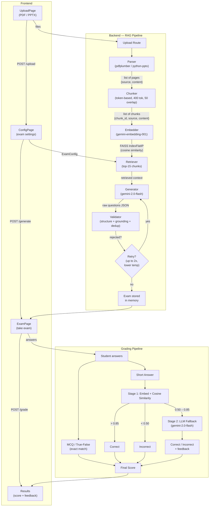
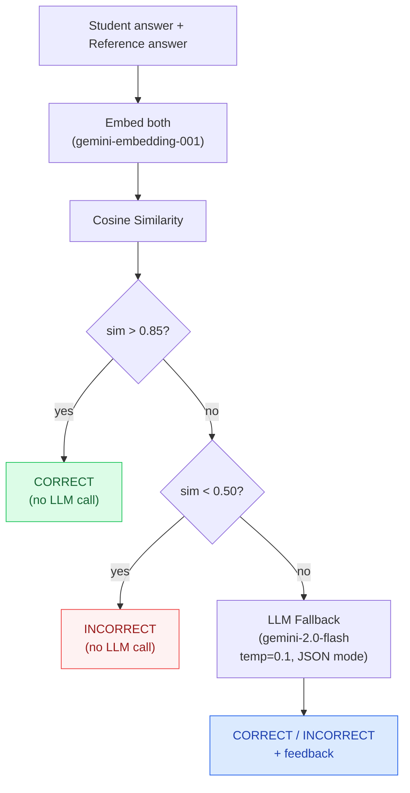

# Exam Generator

A full-stack web application that generates high-quality exam questions from uploaded lecture materials (PDF/PPTX) using Retrieval-Augmented Generation (RAG). Questions are strictly grounded in the uploaded content to minimize hallucination.

## Pipeline Overview

### End-to-End Flow



### Data Flow Through Services

```mermaid
flowchart LR
    PDF["PDF / PPTX\nfiles"] --> parser["parser.py\nparse_file()"]
    parser -->|"[{source, content}]"| chunker["chunker.py\nchunk_pages()"]
    chunker -->|"[{chunk_id, source, content}]"| embedder["embedder.py\nbuild_faiss_index()"]
    embedder -->|"FAISS index + chunks"| retriever["retriever.py\nretrieve_chunks()"]
    retriever -->|"top-K chunks + scores"| generator["generator.py\ngenerate_questions()"]
    generator -->|"raw questions"| validator["validator.py\nvalidate_questions()"]
    validator -->|"valid questions"| grader["grader.py\ngrade_exam()"]
    grader -->|"score + details"| result["GradeResponse"]
```



### Short Answer Grading Detail



## Features

- **File Upload** — Accepts PDF and PPTX files; extracts text at page/slide level
- **RAG Pipeline** — Chunks documents, embeds with Gemini, stores in FAISS, retrieves relevant context before generating questions
- **Question Generation** — Produces MCQ, True/False, and Short Answer questions using a strict prompt template with anti-hallucination constraints
- **Validation & Regeneration** — Validates every generated question against source context; retries with lower temperature on failure (up to 2 retries)
- **Interactive Exam UI** — Countdown timer, question navigation, and submit functionality
- **Hybrid Grading** — MCQ/True-False graded by exact match; Short answers graded via a two-stage pipeline (cosine similarity fast filter + LLM fallback)
- **Results Review** — Score, percentage, correct answers, explanations, and grading feedback

## Tech Stack

| Layer | Technology |
|-------|------------|
| Backend | Python, FastAPI |
| LLM | Google Gemini (`gemini-2.0-flash`) |
| Embeddings | Gemini `gemini-embedding-001` |
| Vector DB | FAISS (in-memory, cosine similarity) |
| File Parsing | pdfplumber (PDF), python-pptx (PPTX) |
| Frontend | React, React Router, Axios |

## Project Structure

```
backend/
  app.py                  # FastAPI app entry point
  .env                    # GEMINI_API_KEY (not committed)
  requirements.txt
  routes/
    upload.py             # POST /upload
    generate.py           # POST /generate, GET /exam/:id, POST /grade
  services/
    parser.py             # PDF + PPTX text extraction
    chunker.py            # Token-based chunking with overlap
    embedder.py           # Gemini embeddings + FAISS index
    retriever.py          # FAISS similarity search
    generator.py          # Question generation via Gemini
    validator.py          # Question validation (grounding, duplicates)
    grader.py             # Hybrid grading pipeline
  models/
    schema.py             # Pydantic request/response models

frontend/
  src/
    App.js                # Router
    App.css               # Styles
    pages/
      UploadPage.jsx      # File upload with drag-and-drop
      ConfigPage.jsx      # Exam configuration form
      ExamPage.jsx        # Exam taking, grading, results
    components/
      Timer.jsx           # Countdown timer
      Question.jsx        # Question renderer (MCQ, T/F, Short Answer)
```

## Prerequisites

- Python 3.10+
- Node.js 16+
- A Google Gemini API key — get one at https://aistudio.google.com/apikey

## Setup

### 1. Clone the repository

```bash
git clone https://github.com/DanielK345/Exam-generator.git
cd Exam-generator
```

### 2. Backend

```bash
cd backend
pip install -r requirements.txt
```

Create a `.env` file (or edit the existing one) with your API key:

```
GEMINI_API_KEY=your-api-key-here
```

Start the server:

```bash
uvicorn app:app --reload --port 8000
```

The API will be available at `http://localhost:8000`. You can verify with:

```bash
curl http://localhost:8000/health
# {"status":"ok"}
```

### 3. Frontend

```bash
cd frontend
npm install
npm start
```

The app will open at `http://localhost:3000`.

## Usage

1. **Upload** — Open the app and upload a PDF or PPTX file
2. **Configure** — Set the number of MCQ, True/False, and Short Answer questions, difficulty level, time limit, and optionally a focus area
3. **Generate** — Click "Generate Exam" and wait for the RAG pipeline to process
4. **Take the Exam** — Answer questions before the timer runs out
5. **Submit** — Get your score, correct answers, explanations, and grading feedback

## API Endpoints

| Method | Endpoint | Description |
|--------|----------|-------------|
| `GET` | `/health` | Health check |
| `POST` | `/upload` | Upload PDF/PPTX, returns `document_id` |
| `POST` | `/generate` | Generate exam from document + config |
| `GET` | `/exam/{exam_id}` | Retrieve a generated exam |
| `POST` | `/grade` | Grade an exam submission |

## Short Answer Grading

Short answers use a hybrid two-stage pipeline to balance accuracy and cost:

1. **Stage 1 — Semantic Similarity (fast filter):**
   Embeds both student and reference answers, computes cosine similarity.
   - `> 0.85` — marked correct (no LLM call)
   - `< 0.50` — marked incorrect (no LLM call)
   - `0.50–0.85` — inconclusive, sent to Stage 2

2. **Stage 2 — LLM Grading (fallback):**
   Calls Gemini with a strict grading prompt. Only used when similarity is inconclusive.

## License

MIT
